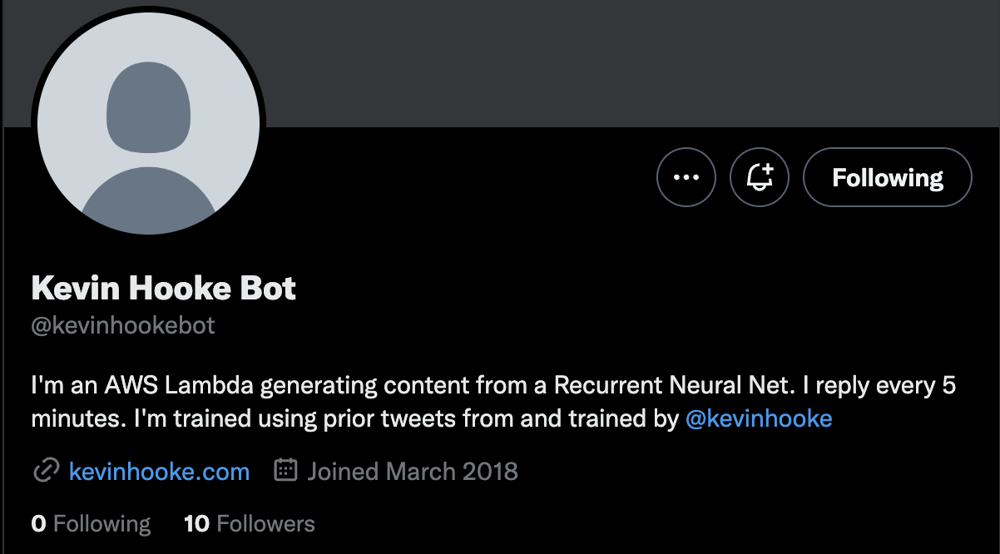
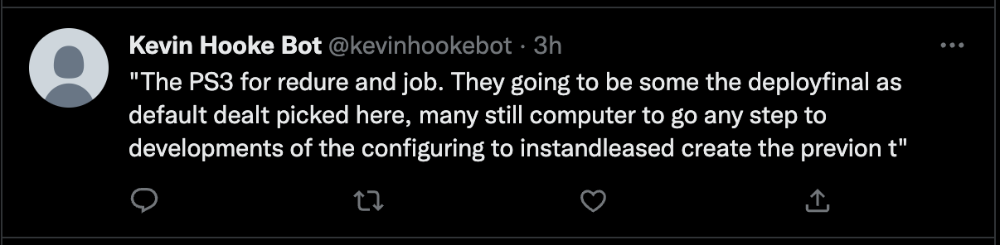

# Twitter Bot

Originally developed: March 2018

Shared on GitHub: Nov 2022

@kevinhooke first live: March 2018

Tweets since live (as of November 2022: > 11,000)

https://twitter.com/kevinhookebot

## Overview

This is a Twitter bot deployed to AWS using a Lambda to send tweet messages on a schedule
(currently every 3 hours, or 8 times day). It's a wrapper for a related project that I developed to
generate text using a ML trained model from my articles on my blog (at https://www.kevinhooke.com).

This bot reads text from a DynamoDB table that are queued ready to be tweeted, authicates with Twitter
using OAuth, and then sends a Tweet using the Twitter API. The send messages is updated in the 
DynamoDB table to record the text as sent.

Here's an example of a generated text after Tweeting by the bot:

## History and related articles

todo